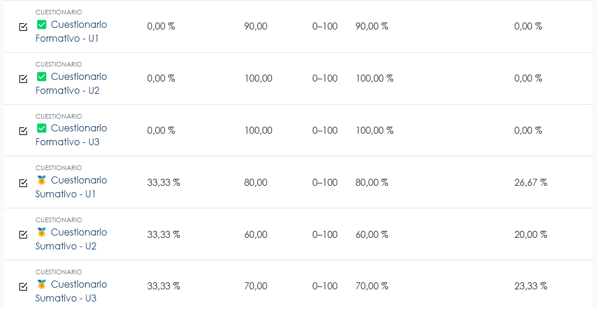
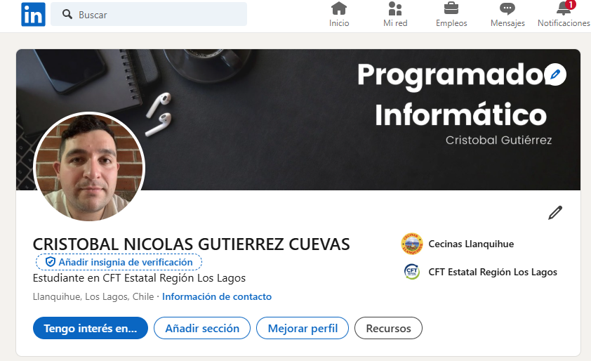
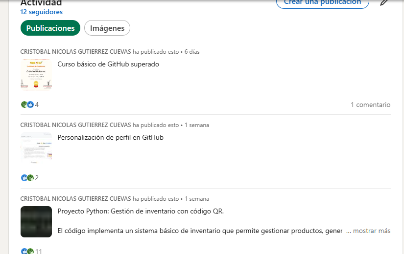
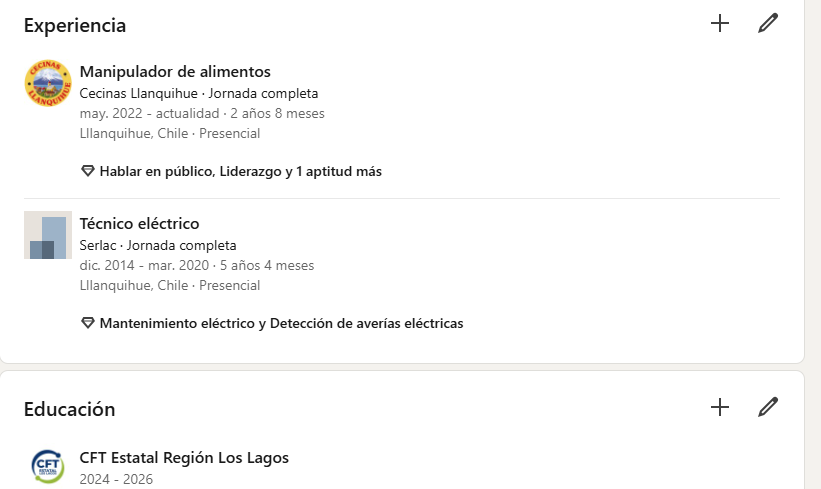
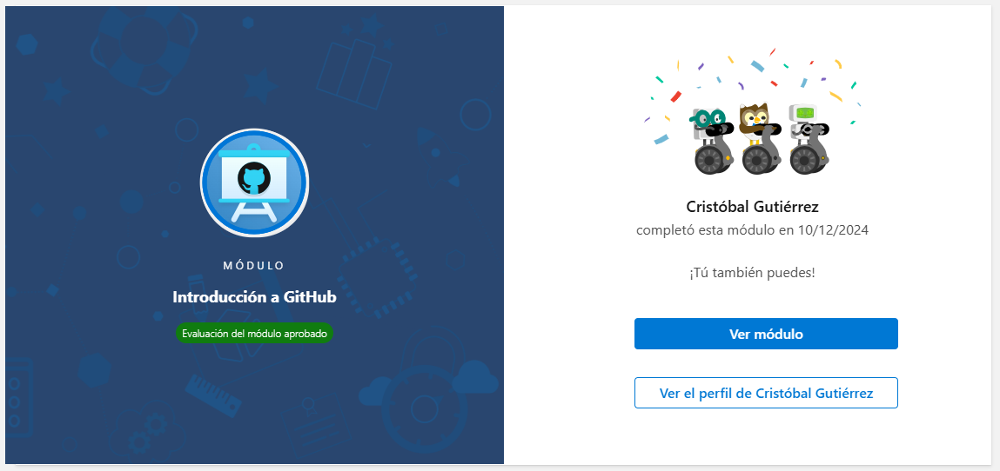
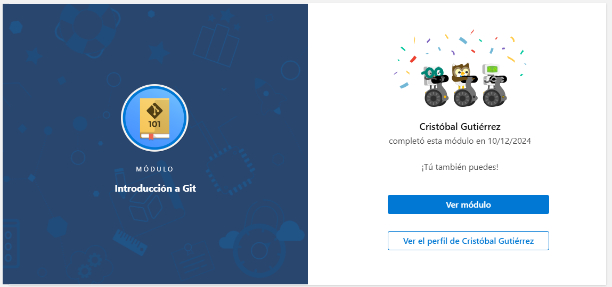
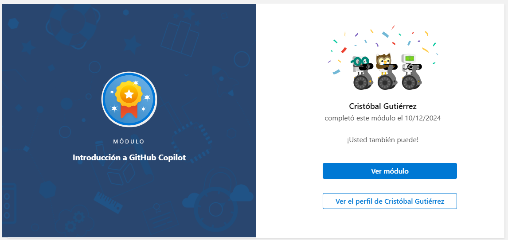
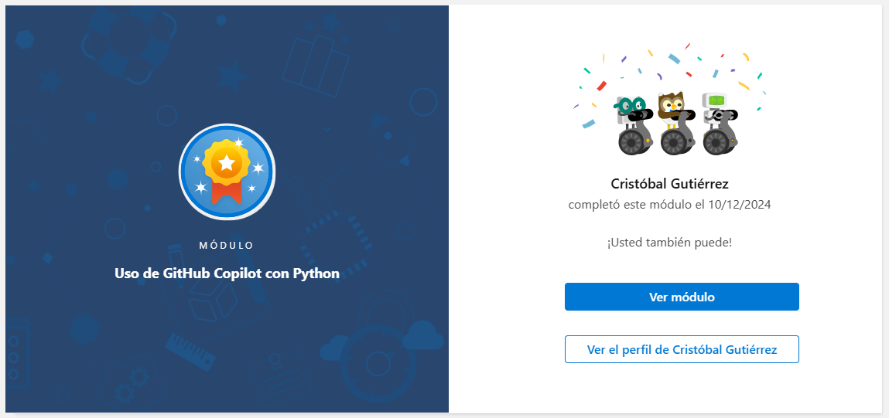
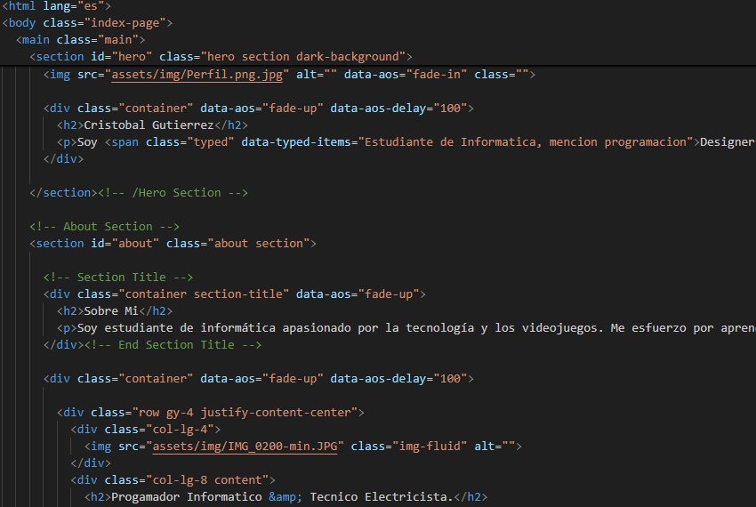
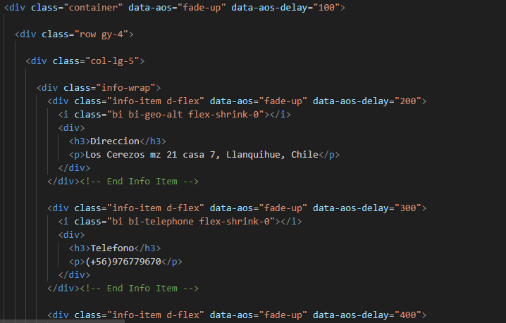

<h1 class="code-line" data-line-start=0 data-line-end=1 >Examen final</h1>
<h2 class="code-line" data-line-start=1 data-line-end=2 ><em>Conceptos tecnicos informatica.</em></h2>
<h3 class="code-line" data-line-start=2 data-line-end=3 >A continuación se adjunta evidencia de todos los ítems a desarrollar en el examen final de conceptos básicos de la informática.</h3>

Completa las actividades prácticas asignadas y entrega la evidencia correspondiente en un repositorio de GitHub.

<ol>
<li class="has-line-data" data-line-start="6" data-line-end="8">Cuestionarios en Quinttos: 
Realizar todos los cuestionarios formativos y sumativos disponibles en la plataforma Quinttos relacionados con la asignatura.</li>
</a>
</ol>
<ol start="2">
<li class="has-line-data" data-line-start="10" data-line-end="11">Cuenta de LinkedIn:</li>
</ol>
<ul>
<li class="has-line-data" data-line-start="11" data-line-end="22">Crear y completar un perfil de <strong>LinkedIn</strong> profesional:
<ul>
<li class="has-line-data" data-line-start="12" data-line-end="13">Foto de perfil presentable.</li>
<li class="has-line-data" data-line-start="13" data-line-end="14">Imagen de cabecera adecuada.</li>
<li class="has-line-data" data-line-start="14" data-line-end="15">Publicar experiencia laboral, proyectos o estudios (si aplica).</li>
<li class="has-line-data" data-line-start="15" data-line-end="16">Subir diplomas, títulos o certificados (al menos 3).</li>
<li class="has-line-data" data-line-start="16" data-line-end="17">Agregar que están estudiando en el <strong>CFT Los Lagos</strong>.</li>
<li class="has-line-data" data-line-start="17" data-line-end="18">Seguir la página del <strong>CFT Los Lagos</strong>.</li>
<li class="has-line-data" data-line-start="18" data-line-end="19">Enviar solicitud al docente.</li>
<li class="has-line-data" data-line-start="19" data-line-end="20">Publicar al menos <strong>3 publicaciones</strong> sobre avances, trabajos o aprendizajes.</li>
<li class="has-line-data" data-line-start="20" data-line-end="22">Enlazar tu perfil de GitHub en LinkedIn y viceversa.</li>
</a>
</a>
</a>
</ul>
</li>
</ul>
<ol start="3">
<li class="has-line-data" data-line-start="22" data-line-end="23">Cursos en Microsoft Learn:</li>
</ol>
<ul>
<li class="has-line-data" data-line-start="23" data-line-end="29">Completar los <strong>4 módulos de Microsoft Learn</strong> sobre Git:
<ul>
<li class="has-line-data" data-line-start="24" data-line-end="25">Introducción a GitHub Copilot.</li>
<li class="has-line-data" data-line-start="25" data-line-end="26">Introducción a GitHub.</li>
<li class="has-line-data" data-line-start="26" data-line-end="27">Introducción a Git.</li>
<li class="has-line-data" data-line-start="27" data-line-end="29">Uso de GitHub Copilot con Python.</li>
</a>
</a>
</a>
</a>
</ul>
</li>
</ul>
<ol start="4">
<li class="has-line-data" data-line-start="29" data-line-end="30">Creación de un portafolio profesional:</li>
</ol>
<ul>
<li class="has-line-data" data-line-start="30" data-line-end="31">Descargar un <strong>template de portafolio</strong> desde <a href="https://themewagon.com/theme-tag/portfolio-template/">ThemeWagon</a>.</li>
<li class="has-line-data" data-line-start="31" data-line-end="36">Adaptar el portafolio con los siguientes requisitos:
<ul>
<li class="has-line-data" data-line-start="32" data-line-end="33">Personalizar completamente con tus datos, habilidades y certificaciones (no debe parecer un template).</li>
<li class="has-line-data" data-line-start="33" data-line-end="34">Agregar enlaces importantes, como el perfil de LinkedIn y GitHub.</li>
<li class="has-line-data" data-line-start="34" data-line-end="35">Incluir un formulario de contacto configurado con <strong>FormSubmit</strong> para recibir correos directamente en tu email.</li>
<li class="has-line-data" data-line-start="35" data-line-end="36">Probar la funcionalidad del formulario de contacto.</li>
</ul>
</li>
<li class="has-line-data" data-line-start="36" data-line-end="38">El diseño debe ser funcional, adaptado a dispositivos móviles (responsive) y sin elementos que indiquen que es un template</li>
</ul>
<ol start="5">
<li class="has-line-data" data-line-start="38" data-line-end="39">Entrega de evidencia en GitHub:</li>
</a>
</a>
</ol>
<ul>
<li class="has-line-data" data-line-start="39" data-line-end="40">Crear un repositorio en GitHub con el siguiente formato:<code>examenFinal_ConceptosTecnicos_NombreAlumno_CFT_LOS_LAGOS</code></li>
<li class="has-line-data" data-line-start="40" data-line-end="47">Subir la evidencia organizada en el repositorio, incluyendo:
<ul>
<li class="has-line-data" data-line-start="41" data-line-end="42">Capturas de pantalla de cuestionarios, perfil de LinkedIn, medallas de GitHub, módulos de Microsoft Learn y portafolio.</li>
<li class="has-line-data" data-line-start="42" data-line-end="43">El portafolio debe estar alojado en el repositorio.</li>
<li class="has-line-data" data-line-start="43" data-line-end="47">Incluir un archivo <code>README.md</code> explicativo que contenga:
<ul>
<li class="has-line-data" data-line-start="44" data-line-end="45">Descripción del examen.</li>
<li class="has-line-data" data-line-start="45" data-line-end="46">Detalles de la evidencia.</li>
<li class="has-line-data" data-line-start="46" data-line-end="47">Capturas de pantalla integradas en el <code>README.md</code>.</li>
</ul>
</li>
</ul>
</li>
</ul>